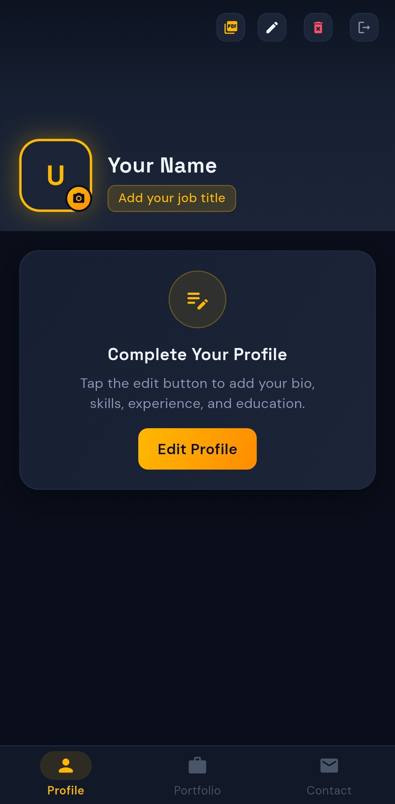
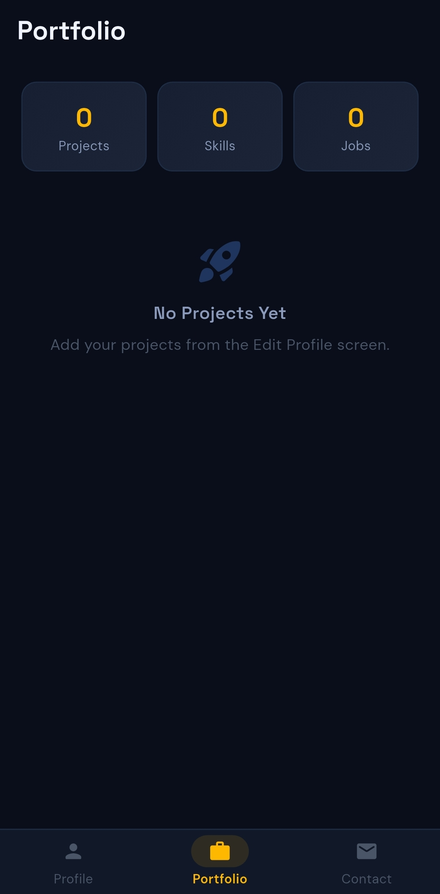
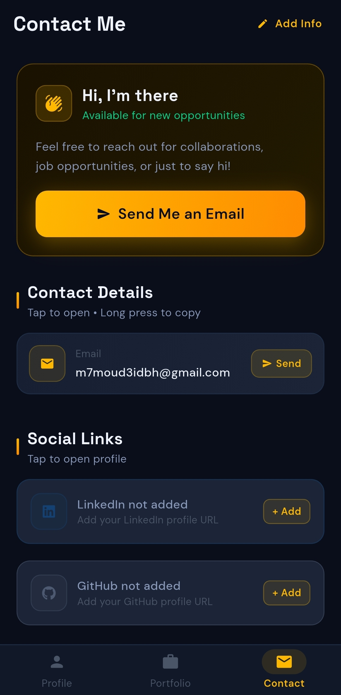
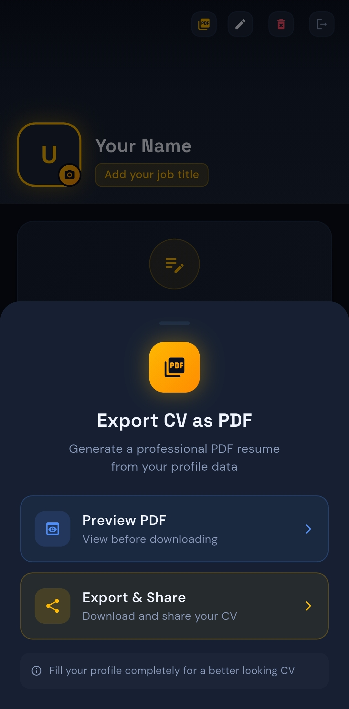

# 📱 PortfolioMe — Digital CV & Portfolio App

<p align="center">
  <strong>Build and share your professional CV from your phone</strong><br/>
  Flutter · Firebase · Cloudinary
</p>

<p align="center">
  <a href="https://YOUR_USERNAME.github.io/portfoliome/privacy_policy.html">Privacy Policy</a>
</p>

---

## ✨ Features

- 🔐 **Authentication** — Email/password login with Remember Me
- 👤 **Profile Builder** — Name, bio, location, contact info
- 💼 **Experience** — Add/edit/delete work history
- 🎓 **Education** — Degrees and certifications
- 🚀 **Projects** — Portfolio with GitHub & live links
- 🛠️ **Skills** — Tag-based skills display
- 📸 **Photo Upload** — Profile photo via Cloudinary
- 📄 **PDF Export** — Generate and share a professional CV
- 📱 **Contact Page** — One-tap email, call, open LinkedIn/GitHub

---

## 📸 Screenshots


| Profile | Portfolio | Contact |                                    PDF Export                                    |
|:---:|:---:|:---:|:--------------------------------------------------------------------------------:|
|  |  |  |  |

---

## 🛠️ Tech Stack

| Layer | Technology |
|-------|-----------|
| Framework | Flutter 3.x |
| Auth | Firebase Authentication |
| Database | Cloud Firestore |
| Storage | Cloudinary (free tier) |
| State | Provider |
| PDF | pdf + printing packages |
| Fonts | DM Sans · Space Grotesk |

---

## 🚀 Getting Started

### Prerequisites
- Flutter SDK `>=3.0.0`
- Firebase project (Authentication + Firestore enabled)
- Cloudinary account (free)

### Setup

**1. Clone the repo**
```bash
git clone https://github.com/YOUR_USERNAME/portfoliome.git
cd portfoliome
```

**2. Install dependencies**
```bash
flutter pub get
```

**3. Configure Firebase**
```bash
dart pub global activate flutterfire_cli
flutterfire configure
```
Place `google-services.json` in `android/app/`

**4. Configure Cloudinary**

In `lib/data/services/storage_service.dart`:
```dart
static const String _cloudName    = 'your_cloud_name';
static const String _uploadPreset = 'cv_app_uploads';
```

**5. Run**
```bash
flutter run
```

---

## 🔥 Firebase Setup

1. Go to [console.firebase.google.com](https://console.firebase.google.com)
2. Create project → Add Android app
3. Enable **Authentication** → Email/Password
4. Create **Firestore** database → Production mode
5. Apply Firestore security rules from `firestore.rules`

---

## 📦 Build Release AAB

```bash
# 1. Generate keystore (first time only)
keytool -genkey -v -keystore android/app/cv_keystore.jks \
  -keyalg RSA -keysize 2048 -validity 10000 -alias cv_key

# 2. Create android/key.properties with your passwords

# 3. Build
flutter build appbundle --release
```

Output: `build/app/outputs/bundle/release/app-release.aab`

---

## 📄 Privacy Policy

[View Privacy Policy](https://YOUR_USERNAME.github.io/portfoliome/privacy_policy.html)

---

## 👨‍💻 Developer

Built by **Mahmoud** — Flutter Developer from Jordan 🇯🇴

---

## 📜 License

MIT License — free to use for learning purposes.